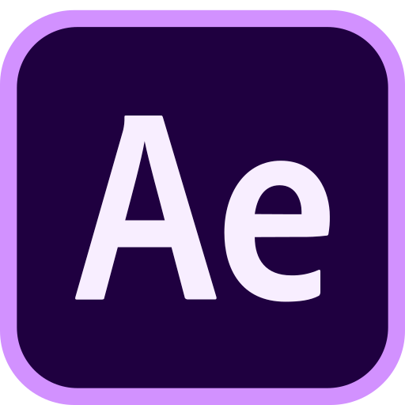

<h1 align="center">
  Hello, World!&nbsp;
  
</h1>

 
 

- 🔭 I’m currently working on **Python, Node.js, JavaScript, Java, and other Web Developments**
- 🌱 I’m currently learning **Kotlin** for Minecraft plugin
- 🤔 Programming is better than games. maybe
- 💬 Ask me about Anything [here](https://github.com/namnyang/namnyang/issues/1)!
- ⚡ Fun fact : **HTML is not programming language**

 
 
 
 
 
 

<!--    &nbsp; -->
   &nbsp;
   &nbsp;
   &nbsp;

 

  <h2>
    Contact Me
    
  </h2>

<!--   &nbsp;
  &nbsp; -->
   &nbsp;
   &nbsp;
   &nbsp;
   &nbsp;

 

<h2 align="center">Languages And Tools</h2>

   &nbsp;
   &nbsp;
   &nbsp;
   &nbsp;
   &nbsp;
   &nbsp;
   &nbsp;
   &nbsp; &nbsp;
   &nbsp;
   &nbsp;
   &nbsp;

**Credits**: [NY0510](https://github.com/NY0510/)

**Last Edited**: 09/07/2021

